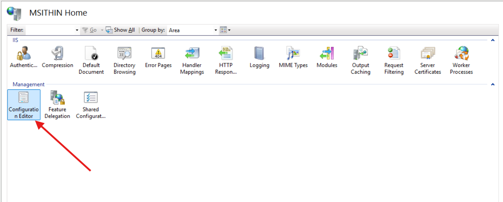
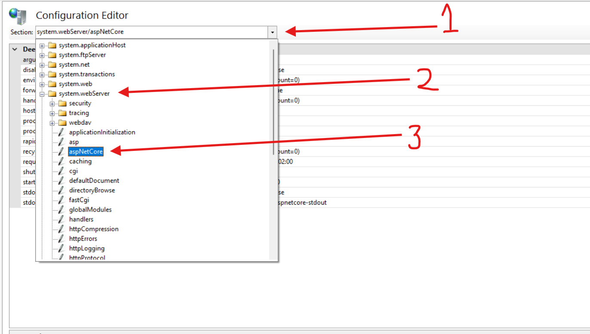
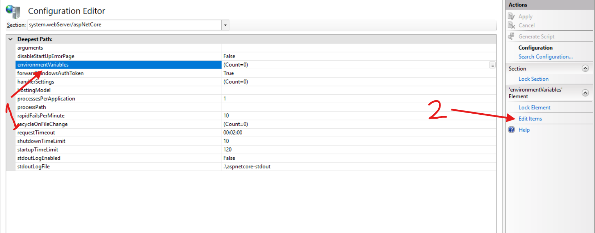
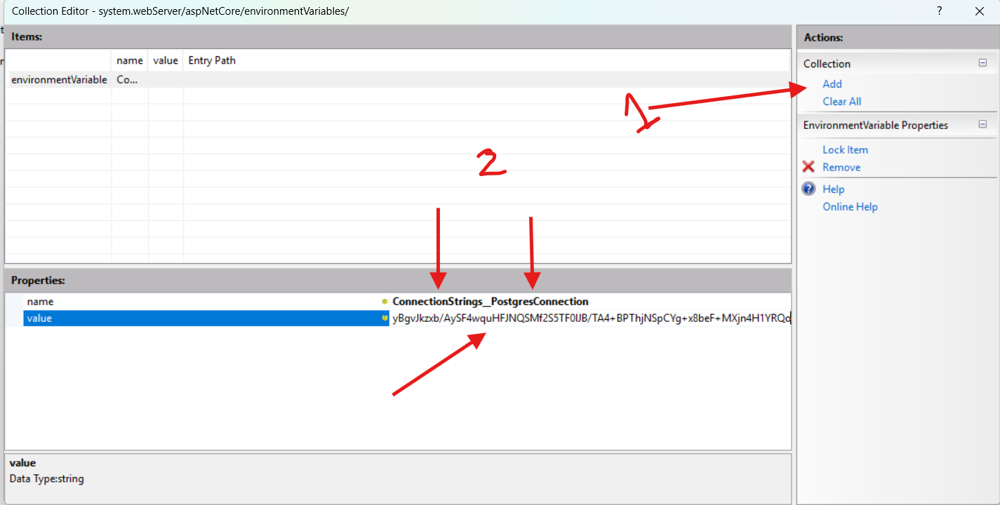

# Setup Process for Providing an Encrypted Connection String for a Published API on IIS

This document provides step-by-step instructions to set up an encrypted connection string for a published API hosted on IIS. The setup requires PowerShell 7 and the .NET Hosting Bundle.

---

## Prerequisites

1. **Install IIS**: Ensure that IIS is installed and configured on your server.
2. **PowerShell 7**: Download and install PowerShell 7 from the [official website](https://github.com/PowerShell/PowerShell/releases/tag/v7.4.6).
3. **.NET Hosting Bundle**: Install the appropriate version of the .NET Hosting Bundle for your application. You can download it from the [.NET website](https://dotnet.microsoft.com/en-us/download/dotnet/thank-you/runtime-aspnetcore-8.0.12-windows-hosting-bundle-installer).

---

## Step 1: Encrypt the Connection String

### 1.1 Open PowerShell 7

- Launch PowerShell 7 with administrative privileges.

### 1.2 Run the Encryption Script

Copy and paste the following script into PowerShell:

```powershell
# Prompt the user for the connection string
$PlainText = Read-Host -Prompt "Enter the connection string to encrypt"

# Convert the plain text to bytes
$PlainTextBytes = [System.Text.Encoding]::UTF8.GetBytes($PlainText)

# Encrypt using DPAPI, tied to the machine
$EncryptedBytes = [System.Security.Cryptography.ProtectedData]::Protect(
    $PlainTextBytes,
    $null,
    [System.Security.Cryptography.DataProtectionScope]::LocalMachine
)

# Convert the encrypted bytes to Base64 for easy transfer or storage
$EncryptedBase64 = [Convert]::ToBase64String($EncryptedBytes)

# Output the encrypted connection string
Write-Output "Encrypted Connection String: $EncryptedBase64"
```

### 1.3 Enter the Connection String

- When prompted, enter the plaintext connection string.

### 1.4 Save the Output

- Copy the generated **Encrypted Connection String**. This will be used in the next step.

---

## Step 2: Store the Encrypted Connection String in IIS ASP.NET Core Environment Variables

### 2.1 Configure IIS Environment Variables

1. Open **IIS Manager**.
2. Select your website or application.
3. Open **Configuration Editor**.
   
4. Navigate to `system.webServer/aspNetCore/environmentVariables`.
   
5. Add a new environment variable with the name `ConnectionStrings__PostgresConnection` and the value set to the encrypted connection string.


 

6. Save the changes and restart IIS.

### 2.2 Example Configuration in web.config

The connection string will appear in the web.config file as follows:

```xml
<aspNetCore processPath="dotnet" arguments=".\your-app.dll" stdoutLogEnabled="false" stdoutLogFile=".\logs\stdout" hostingModel="inprocess">
    <environmentVariables>
        <environmentVariable name="ConnectionStrings__PostgresConnection" value="AQAAANCMnd8BFdERjHoAwE/Cl+sBAAA26DSNGdi4kKL6qc7xV6Q3wQAAAACAAAAAAAQZgAAAAEAACAAAAAPkSSzhoyzi2p2aWvM+ioSQ4nZVVvzgnc0Grad6T40gBBAAAOgAAAAAIAACAAAACfFzv4bbSQg+NCqlA+hmeXHVi0Gtqmjpgts32FzA0lFAAAABj0uqqbRI9zzZeFuXQ65X3Osqf1LO37Ml316qqHzd83ueJ00ZtBaEjRvKTjbdknoJEG+swK+qvQBRqIYjs/bxaIQWtlhvMW8ZY1k2bpJWVUAAAAChyd17WXXZ6IXUBaXyBgvJkzxb/AySF4wquHFJNQSMf2S5TF0lJB/TA4+BPThjNSpCYg+x8beF+MXjn4H1YRQo" />
    </environmentVariables>
</aspNetCore>
```

---

## Troubleshooting Tips

1. **Verify Naming Conventions**:

   - Ensure the environment variable name matches the expected format in your application.
   - Use double underscores (\_\_) to represent nested keys in ASP.NET Core configuration.

2. **Application Pool Permissions**:

   - Ensure the IIS application pool identity has the necessary permissions to access resources.

3. **Restart IIS**:

   - Restart IIS after making configuration changes to ensure they take effect.

4. **Debugging Configuration Issues**:
   - Check the web.config file for correctness.
   - Use logs to identify issues related to environment variable injection or connection string decryption.
